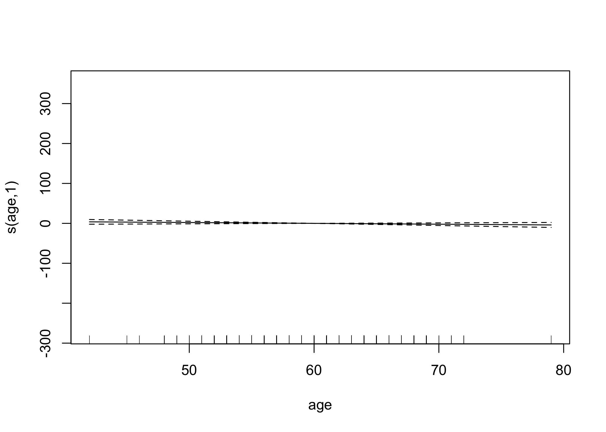
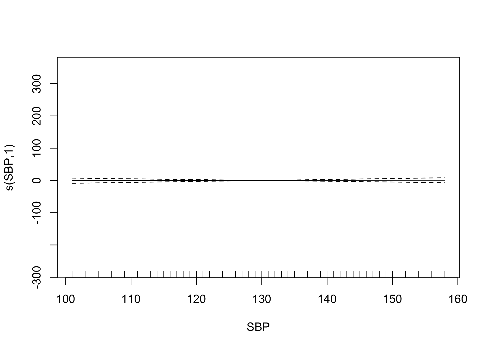
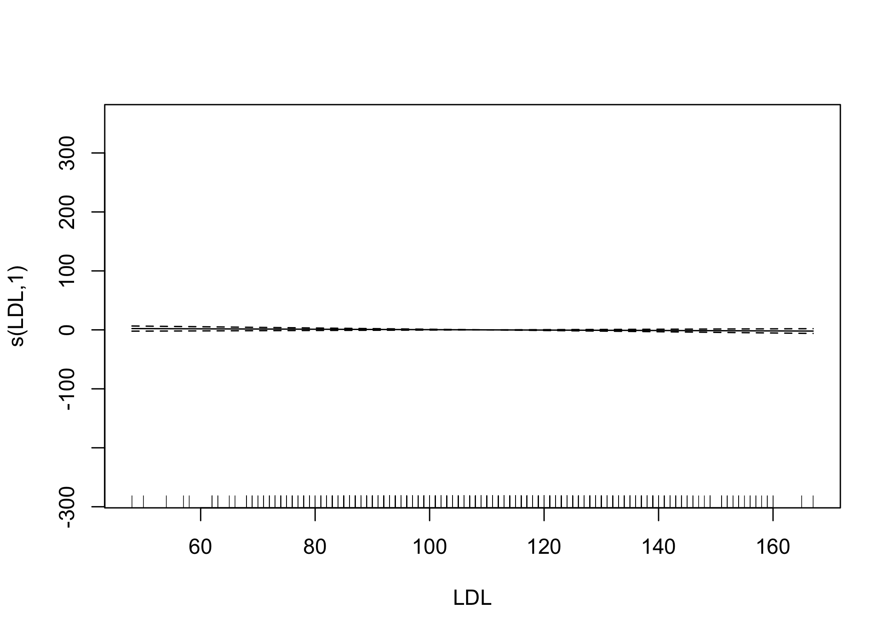
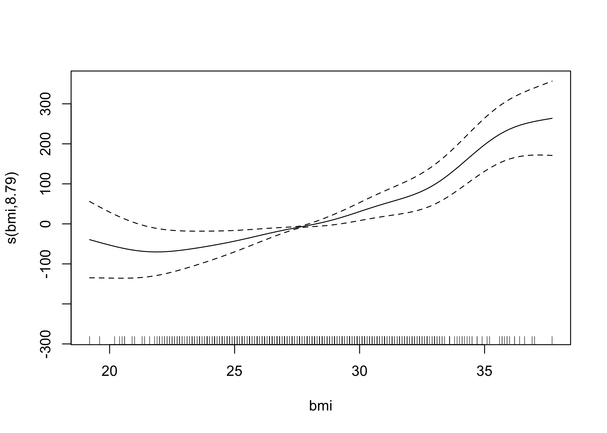
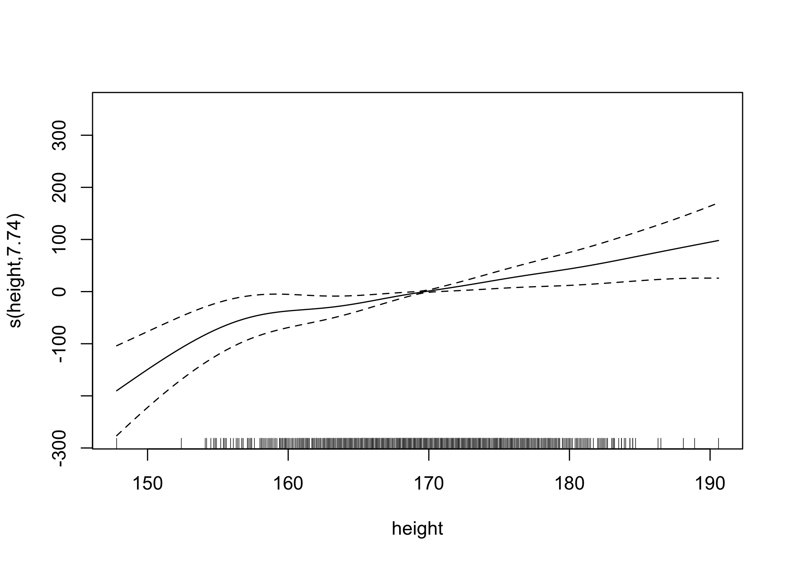
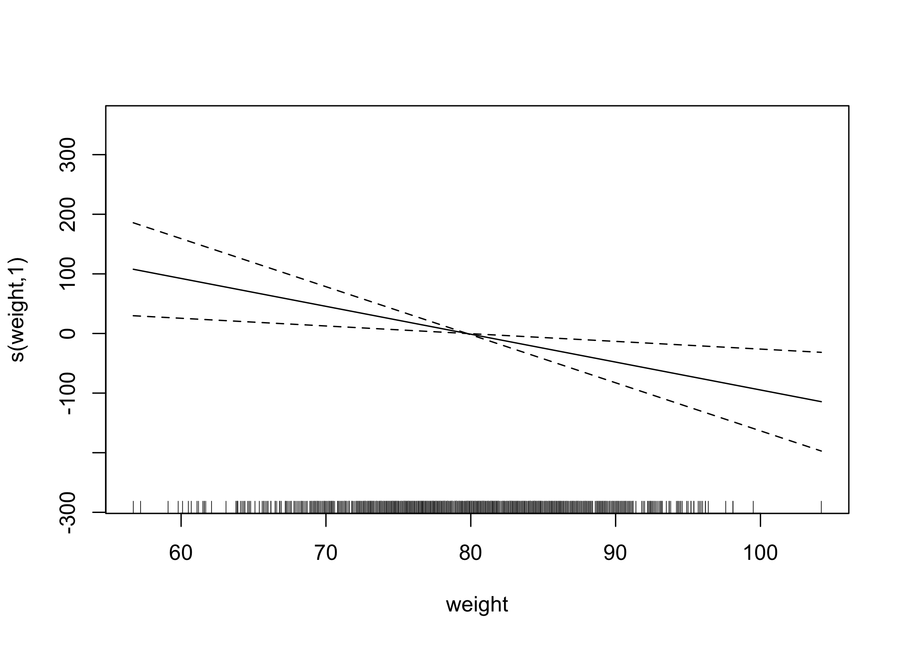

P8106 Data Science II Midterm Project Report: Predicting COVID-19
Recovery Time and Identifying Important Risk Factors
================
Sarah Forrest - sef2183
4/5/2023

# Background

To gain a better understanding of the factors that predict recovery time
from COVID-19 illness, this study was designed to combine three existing
cohort studies that have been tracking participants for several years.
This study collects recovery information through questionnaires and
medical records, and leverages existing data on personal characteristics
prior to the pandemic. The ultimate goal is to develop a prediction
model for recovery time and identify important risk factors for long
recovery time.

# Data

This study uses data from the `recovery.RData` file. The dataset
contains a variable for the time from COVID-19 infection to recovery (in
days), which is the outcome of interest in this study. It also contains
14 predictor variables, including demographic characteristics, personal
characteristics, vital measurements, and disease status. The predictors
are a mix of continuous and categorical variables.

The `recovery.RData` file consists of data on 10000 participants. A
random sample of 2000 participants was used for analysis. Additionally,
the random sample of 2000 participants was further split into training
and test datasets using the `createDataPartition()` function in R. The
training dataset contained 70% of the sample and the test dataset
contained the remaining 30%. All data partitions were conducted using a
seed set to my UNI number (2183) for reproducibility.

# Exploratory Analysis and Data Visualization:

Lattice plots were created using the `featurePlot()` function in the
caret package to explore the multivariate dataset and identify patterns
or relationships. A plot is created for each of the 14 predictors in the
dataset in order to visualize each predictor’s association with the
outcome, COVID-19 recovery time.

<!-- -->

Using the lattice plot in Figure 1. the following patterns were
observed:

-   Patient age does not appear to have a clear association with
    COVID-19 recovery time. The mostly straight horizontal line shows
    that both low and high values for age have similar values for
    recovery time. The age variable appears to be normally distributed,
    with most data points in the middle between the minimum age (42) and
    maximum age (79).
-   For the gender variable, male patients were assigned a value of 1
    and female patients were assigned a value of 0. Therefore, the plot
    shows that males appear to have a longer recovery time than females
    in the dataset.
-   For the race variable, White patients were assigned a value of 1,
    Asian patients were assigned 2, Black patients were assigned 3, and
    Hispanic patients were assigned 4. The plot shows that White
    patients appear to have a shorter recovery time compared to all
    other races.
-   For the smoking variable, patients who never smoked were assigned a
    value of 0, former smokers were assigned 1, and current smokers were
    assigned 2. The plot shows that never smokers appear to have a
    shorter recovery time compared to former and current smokers. There
    is a positive association between smoking and recovery time.
-   A slight negative association can be observed between patient height
    and recovery time. Patients with lower height values (shorter
    patients) appear to have a slightly longer recovery time than
    patients with higher height values (taller patients).
-   A slight positive association can be observed between patient weight
    and recovery time. Patients with lower weight values appear to have
    a slightly shorter recovery time than patients with higher weight
    values.
-   A slight U-shaped association can be observed between patient bmi
    and recovery time. Patients with bmi values near the minimum (19.2)
    and maximum (37.7) in the dataset have longer recovery times than
    patients with bmi values in the middle (25-30).
-   For the hypertension variable, patients without hypertension were
    assigned a value of 0 and patients with hypertension were assigned a
    value of 1. The plot shows that patients with hypertension appear to
    have a longer recovery time compared to patients without
    hypertension. There is a positive association between hypertension
    and recovery time.
-   For the diabetes variable, patients without diabetes were assigned a
    value of 0 and patients with diabetes were assigned a value of 1.
    The plot shows that patients with diabetes appear to have a longer
    recovery time compared to patients without diabetes. There is a
    positive association between diabetes and recovery time.
-   Patient systolic blood pressure (SBP) does not appear to have a
    clear association with recovery time. The mostly straight horizontal
    line shows that both low and high values for SBP have similar values
    for recovery time.
-   Patient LDL cholesterol does not appear to have a clear association
    with recovery time. The mostly straight horizontal line shows that
    both low and high values for LDL have similar values for recovery
    time.
-   For the vaccine variable, unvaccinated patients at the time of
    infection were assigned a value of 0 and vaccinated patients were
    assigned a value of 1. The plot shows that vaccinated patients
    appear to have a shorter recovery time compared to unvaccinated
    patients. There is a negative association between vaccination and
    recovery time.
-   For the severity variable, patients without severe COVID-19
    infection were assigned a value of 0 and patients with severe
    COVID-19 infection were assigned a value of 1. The plot shows that
    patients with severe infections appear to have a longer recovery
    time compared to patients without severe infections. There is a
    positive association between severity and recovery time.
-   For the study variable, patients in study A were assigned a value of
    1, patients in study B were assigned a value of 2, patients in study
    C were assigned a value of 3. The plot shows that patients in study
    B had a shorter recovery time compared to patients in studies A
    and C.

# Model Training

Several different models were fit using all predictors to predict time
to recovery from COVID-19.

The `train()` function from the caret package was used to fit each model
to the training dataset using cross-validation with 10 folds repeated
5-times. The `trainControl()` function was used to specify this
cross-validation method, which was called on within the `train()`
function using the trControl argument. Additionally, the method argument
was used within the `train()` function to specify the type of model to
fit. The resulting model object for each model contains the final model
(finalModel) and information about the cross-validation performance.

The `predict()` function from the caret package was also used to
generate predictions for the test dataset using each final model that
was trained using the training dataset. The root mean squared error
(RMSE) between the predicted and actual recovery times on the test
dataset was calculated in order to evaluate each model’s performance and
support model comparison.

This approach results in a final model that has been trained using
cross-validation, which can help to reduce overfitting and improve the
generalization performance of the model on new, unseen data for future
prediction purposes.

\[X and Y as inputs\]

**1. Linear model**

A linear model that assumes a linear relationship between the predictor
and response variables (linearity), and assumes that the errors are
normally distributed (normality) and have constant variance
(homoscedasticity),and that the observations are independent of each
other (independence). The linear model is the most basic and assumes a
linear relationship between the variables, while the other models allow
for more flexible relationships. A method = “lm” argument was used
within the `train()` function to specify a linear model fit.

    ## 
    ## Call:
    ## lm(formula = .outcome ~ ., data = dat)
    ## 
    ## Residuals:
    ##      Min       1Q   Median       3Q      Max 
    ## -100.835  -13.828   -1.023    9.781  286.247 
    ## 
    ## Coefficients:
    ##                Estimate Std. Error t value Pr(>|t|)    
    ## (Intercept)  -3.364e+03  1.976e+02 -17.025  < 2e-16 ***
    ## age          -2.797e-01  1.804e-01  -1.550 0.121310    
    ## gender       -4.758e+00  1.395e+00  -3.411 0.000666 ***
    ## race2         2.876e-01  2.966e+00   0.097 0.922767    
    ## race3        -4.189e-01  1.778e+00  -0.236 0.813759    
    ## race4        -1.523e+00  2.509e+00  -0.607 0.543896    
    ## smoking1      4.969e+00  1.563e+00   3.179 0.001509 ** 
    ## smoking2      7.510e+00  2.336e+00   3.215 0.001336 ** 
    ## height        1.972e+01  1.164e+00  16.939  < 2e-16 ***
    ## weight       -2.133e+01  1.237e+00 -17.247  < 2e-16 ***
    ## bmi           6.370e+01  3.513e+00  18.136  < 2e-16 ***
    ## hypertension  3.905e+00  2.306e+00   1.693 0.090621 .  
    ## diabetes     -2.875e+00  1.966e+00  -1.463 0.143828    
    ## SBP           9.011e-02  1.510e-01   0.597 0.550688    
    ## LDL          -1.173e-02  3.875e-02  -0.303 0.762120    
    ## vaccine      -8.184e+00  1.419e+00  -5.767 9.95e-09 ***
    ## severity      9.221e+00  2.378e+00   3.877 0.000111 ***
    ## studyB        5.023e+00  1.809e+00   2.777 0.005558 ** 
    ## studyC       -1.602e+00  2.214e+00  -0.724 0.469462    
    ## ---
    ## Signif. codes:  0 '***' 0.001 '**' 0.01 '*' 0.05 '.' 0.1 ' ' 1
    ## 
    ## Residual standard error: 25.98 on 1383 degrees of freedom
    ## Multiple R-squared:  0.3079, Adjusted R-squared:  0.2989 
    ## F-statistic: 34.18 on 18 and 1383 DF,  p-value: < 2.2e-16
    ## [1] 27.30982

**2. Lasso model**

A lasso model is a linear regression model that adds a penalty term to
the sum of absolute values of the coefficients to prevent overfitting,
which can lead to sparse models by shrinking some coefficients to zero.
It has the same assumptions as the linear model. A method = “glmnet”
argument was used within the `train()` function to specify a lasso model
fit.

\[ALPHA\] \[LAMBDA\]

    ##             Length Class      Mode     
    ## a0            93   -none-     numeric  
    ## beta        1674   dgCMatrix  S4       
    ## df            93   -none-     numeric  
    ## dim            2   -none-     numeric  
    ## lambda        93   -none-     numeric  
    ## dev.ratio     93   -none-     numeric  
    ## nulldev        1   -none-     numeric  
    ## npasses        1   -none-     numeric  
    ## jerr           1   -none-     numeric  
    ## offset         1   -none-     logical  
    ## call           5   -none-     call     
    ## nobs           1   -none-     numeric  
    ## lambdaOpt      1   -none-     numeric  
    ## xNames        18   -none-     character
    ## problemType    1   -none-     character
    ## tuneValue      2   data.frame list     
    ## obsLevels      1   -none-     logical  
    ## param          0   -none-     list
    ## [1] 27.73567

**3. Elastic net model**

An elastic net model is linear regression model that combines the
penalties of the lasso and ridge regression methods to prevent
overfitting, which can result in better prediction accuracy than either
method alone. It has the same assumptions as the linear model. A method
= “glmnet” argument was used within the `train()` function to specify a
elastic net model fit.

\[ALPHA\] \[LAMBDA\]

    ##             Length Class      Mode     
    ## a0            93   -none-     numeric  
    ## beta        1674   dgCMatrix  S4       
    ## df            93   -none-     numeric  
    ## dim            2   -none-     numeric  
    ## lambda        93   -none-     numeric  
    ## dev.ratio     93   -none-     numeric  
    ## nulldev        1   -none-     numeric  
    ## npasses        1   -none-     numeric  
    ## jerr           1   -none-     numeric  
    ## offset         1   -none-     logical  
    ## call           5   -none-     call     
    ## nobs           1   -none-     numeric  
    ## lambdaOpt      1   -none-     numeric  
    ## xNames        18   -none-     character
    ## problemType    1   -none-     character
    ## tuneValue      2   data.frame list     
    ## obsLevels      1   -none-     logical  
    ## param          0   -none-     list
    ## [1] 26.94222

**4. Partial least squares (PLS) model**

A PLS model is a model that seeks to find a low-dimensional
representation of the predictor variables that explains the maximum
variance in the response variable. It has the same assumptions as the
linear model as well as a latent variable assumption, the assumption
that the predictor variables are linearly related to the response
variable via a set of underlying latent variables. A method = “pls”
argument was used within the `train()` function to specify a PLS model
fit.

\[tuneGrid\] \[preProcess\]

    ## Data:    X dimension: 1402 18 
    ##  Y dimension: 1402 1
    ## Fit method: oscorespls
    ## Number of components considered: 11
    ## TRAINING: % variance explained
    ##           1 comps  2 comps  3 comps  4 comps  5 comps  6 comps  7 comps
    ## X            9.37    15.87    24.74    32.06    38.04    43.55    47.79
    ## .outcome    14.34    15.29    15.44    15.63    16.10    17.31    21.19
    ##           8 comps  9 comps  10 comps  11 comps
    ## X           50.94    54.89     57.94     62.26
    ## .outcome    26.60    28.97     30.56     30.78
    ## [1] 27.32134

**5. Generalized additive model (GAM)**

A GAM is a model that extends the linear model by allowing for nonlinear
relationships between the predictor and response variables, using
flexible functions called splines. It has the same assumptions as the
linear model. A method = “gam” argument was used within the `train()`
function to specify a GAM fit.

\[2 MODELS - tuneGrid\]

    ## 
    ## Family: gaussian 
    ## Link function: identity 
    ## 
    ## Formula:
    ## .outcome ~ gender + race2 + race3 + race4 + smoking1 + smoking2 + 
    ##     hypertension + diabetes + vaccine + severity + studyB + studyC + 
    ##     s(age) + s(SBP) + s(LDL) + s(bmi) + s(height) + s(weight)
    ## 
    ## Parametric coefficients:
    ##              Estimate Std. Error t value Pr(>|t|)    
    ## (Intercept)   42.6484     2.1195  20.122  < 2e-16 ***
    ## gender        -5.3039     1.2736  -4.165 3.31e-05 ***
    ## race2         -0.9167     2.6968  -0.340 0.733965    
    ## race3          0.6748     1.6198   0.417 0.677042    
    ## race4         -1.7393     2.2845  -0.761 0.446589    
    ## smoking1       4.6506     1.4235   3.267 0.001114 ** 
    ## smoking2       8.0189     2.1284   3.768 0.000172 ***
    ## hypertension   5.2189     2.0964   2.490 0.012910 *  
    ## diabetes      -2.1693     1.7875  -1.214 0.225124    
    ## vaccine       -8.0292     1.2915  -6.217 6.72e-10 ***
    ## severity       9.5517     2.1691   4.404 1.15e-05 ***
    ## studyB         4.2897     1.6510   2.598 0.009470 ** 
    ## studyC        -1.5110     2.0152  -0.750 0.453522    
    ## ---
    ## Signif. codes:  0 '***' 0.001 '**' 0.01 '*' 0.05 '.' 0.1 ' ' 1
    ## 
    ## Approximate significance of smooth terms:
    ##             edf Ref.df      F  p-value    
    ## s(age)    1.000  1.000  1.640  0.20058    
    ## s(SBP)    1.000  1.000  0.034  0.85404    
    ## s(LDL)    1.000  1.000  1.009  0.31524    
    ## s(bmi)    8.795  8.985 66.151  < 2e-16 ***
    ## s(height) 7.741  8.605  4.054 5.81e-05 ***
    ## s(weight) 1.000  1.000  7.639  0.00579 ** 
    ## ---
    ## Signif. codes:  0 '***' 0.001 '**' 0.01 '*' 0.05 '.' 0.1 ' ' 1
    ## 
    ## R-sq.(adj) =  0.425   Deviance explained = 43.8%
    ## GCV = 567.18  Scale est. = 553.61    n = 1402
    ## 
    ## Family: gaussian 
    ## Link function: identity 
    ## 
    ## Formula:
    ## .outcome ~ gender + race2 + race3 + race4 + smoking1 + smoking2 + 
    ##     hypertension + diabetes + vaccine + severity + studyB + studyC + 
    ##     s(age) + s(SBP) + s(LDL) + s(bmi) + s(height) + s(weight)
    ## 
    ## Parametric coefficients:
    ##              Estimate Std. Error t value Pr(>|t|)    
    ## (Intercept)   42.7218     1.9674  21.714  < 2e-16 ***
    ## gender        -5.3009     1.2722  -4.167 3.28e-05 ***
    ## race2         -0.8627     2.6916  -0.321 0.748624    
    ## race3          0.6957     1.6182   0.430 0.667335    
    ## race4         -1.7361     2.2804  -0.761 0.446606    
    ## smoking1       4.6688     1.4214   3.285 0.001047 ** 
    ## smoking2       8.0617     2.1250   3.794 0.000155 ***
    ## hypertension   5.0312     1.3159   3.823 0.000138 ***
    ## diabetes      -2.2040     1.7854  -1.234 0.217247    
    ## vaccine       -7.9340     1.2877  -6.161 9.46e-10 ***
    ## severity       9.5456     2.1636   4.412 1.10e-05 ***
    ## studyB         4.2338     1.6469   2.571 0.010252 *  
    ## studyC        -1.6042     2.0078  -0.799 0.424426    
    ## ---
    ## Signif. codes:  0 '***' 0.001 '**' 0.01 '*' 0.05 '.' 0.1 ' ' 1
    ## 
    ## Approximate significance of smooth terms:
    ##                 edf Ref.df      F  p-value    
    ## s(age)    5.026e-01      9  0.121 0.139808    
    ## s(SBP)    2.165e-07      9  0.000 0.969829    
    ## s(LDL)    1.859e-01      9  0.027 0.247466    
    ## s(bmi)    7.715e+00      9 65.842  < 2e-16 ***
    ## s(height) 7.726e+00      9  4.179 3.17e-06 ***
    ## s(weight) 1.000e+00      9  1.436 0.000232 ***
    ## ---
    ## Signif. codes:  0 '***' 0.001 '**' 0.01 '*' 0.05 '.' 0.1 ' ' 1
    ## 
    ## R-sq.(adj) =  0.426   Deviance explained = 43.8%
    ## GCV = 565.13  Scale est. = 552.99    n = 1402
    ## [1] 23.78453
    ## [1] 23.7401

**6. Multivariate adaptive regression spline (MARS) model**

A MARS model is a model that uses piecewise linear or nonlinear
functions to model the relationship between the predictor and response
variables, which can capture complex nonlinear relationships. It has the
same assumptions as the linear model. A method = “earth” argument was
used within the `train()` function to specify a MARS model fit.

\[TUNE GRID\]

    ## Call: earth(x=matrix[1402,18], y=c(44,49,38,46,5...), keepxy=TRUE, degree=2,
    ##             nprune=4)
    ## 
    ##                      coefficients
    ## (Intercept)             -43.33869
    ## h(bmi-23.5)              10.92775
    ## h(30.9-bmi)              10.82866
    ## h(bmi-30.9) * studyB     22.96750
    ## 
    ## Selected 4 of 22 terms, and 2 of 18 predictors (nprune=4)
    ## Termination condition: Reached nk 37
    ## Importance: bmi, studyB, age-unused, gender-unused, race2-unused, ...
    ## Number of terms at each degree of interaction: 1 2 1
    ## GCV 542.6388    RSS 751582.7    GRSq 0.4367837    RSq 0.4427977
    ## [1] 23.06663

**Model comparison**

The models were assessed by comparing the RMSE for each model. Low RMSE
indicates the best performing model (low prediction error), while high
RMSE indicates the worst performing model (high prediction error).

    ## 
    ## Call:
    ## summary.resamples(object = resamp)
    ## 
    ## Models: lm, lasso, enet, pls, gam_all, gam_select, mars 
    ## Number of resamples: 50 
    ## 
    ## MAE 
    ##                Min.  1st Qu.   Median     Mean  3rd Qu.     Max. NA's
    ## lm         12.73505 15.39825 16.12348 16.47142 17.75496 20.12710    0
    ## lasso      13.46116 15.56922 16.52594 16.76562 17.59255 21.58307    0
    ## enet       12.80380 14.94888 16.15967 16.06836 17.07309 20.37231    0
    ## pls        12.74936 15.38941 16.13187 16.47089 17.75006 20.13645    0
    ## gam_all    12.23868 14.72597 15.56555 15.59514 16.25176 18.68100    0
    ## gam_select 12.80144 14.36029 15.49947 15.61425 16.51267 19.37225    0
    ## mars       13.36260 14.03692 15.32847 15.39812 16.31531 19.08560    0
    ## 
    ## RMSE 
    ##                Min.  1st Qu.   Median     Mean  3rd Qu.     Max. NA's
    ## lm         16.82876 21.40034 23.77686 25.68307 29.70809 44.81248    0
    ## lasso      17.16745 22.15436 25.00758 27.85853 33.52794 52.01572    0
    ## enet       16.30816 20.86376 23.51353 26.01873 30.95194 48.57930    0
    ## pls        16.83601 21.40035 23.77552 25.68226 29.70413 44.82724    0
    ## gam_all    15.88988 21.15587 22.91025 24.37900 26.73050 39.29095    0
    ## gam_select 17.15290 20.86770 24.26783 24.58489 27.94064 37.21158    0
    ## mars       17.54908 20.46545 22.14328 23.64786 25.93674 37.85683    0
    ## 
    ## Rsquared 
    ##                  Min.   1st Qu.    Median      Mean   3rd Qu.      Max. NA's
    ## lm         0.05285722 0.2198029 0.2767746 0.2885150 0.3387478 0.5731047    0
    ## lasso      0.01531994 0.1044821 0.1556263 0.1561066 0.1878872 0.3803743    0
    ## enet       0.04358373 0.2111552 0.2718273 0.2694211 0.3090849 0.5422976    0
    ## pls        0.05348801 0.2197665 0.2766038 0.2885046 0.3358747 0.5727813    0
    ## gam_all    0.10729883 0.2735852 0.3530194 0.3695334 0.4524725 0.6629995    0
    ## gam_select 0.09078299 0.2964500 0.3537030 0.3728204 0.4720036 0.6360189    0
    ## mars       0.04978937 0.2303193 0.3635106 0.3824594 0.5128183 0.7686433    0

<!-- -->

According to Figure 2, the lasso model had the highest median training
RMSE (i.e., worst performance), followed by the GAM using select
predictors, the pls model, the linear model, the elastic net model, the
GAM using all predictors, and finally, The MARS model, which had the
lowest median training RMSE (i.e., best performance).

# Results

The final model for predicting time to recovery from COVID-19 was
selected by comparing the median training RMSE for all models created.
The MARS model had the lowest value for mean and median RMSE out of all
models, however, it only contained 4 terms with 2 of the predictors. A
model with so few predictors would not be an ideal model for predicting
recovery time and comprehensively identifying important risk factors for
long recovery time, as so few risk factors were included. Therefore, the
GAM model will all predictors–the second best model in terms of mean and
median RMSE–was selected as the final model for predicting time to
recovery from COVID-19 in this study.

**Model formula**

The final model formula uses the `recovery_time` variable as the outcome
(Y), and the following terms as predictors. Note that “White” (`race` =
0) was set as the reference category for the `race` variable, “Never
Smoker” (`smoking` = 0) was set as the reference category for the
`smoking` variable, and “Study A” (`study` = A) was set as the reference
category for the `study` variable. An s() around the variable name
indicates that a smoothing function was applied to the variable. An
asterisk (\*) next to the term indicates that the term was statistically
significant at the 5% level of significance.

-   `gender`\*
-   Race: Asian (`race2`)
-   Race: Black (`race3`)
-   Race: Hispanic (`race4`)
-   Smoking: former smoker (`smoking1`)\*
-   Smoking: current smoker (`smoking2`)\*
-   `hypertension`\*
-   `diabetes`
-   `vaccine`\*
-   `severity`\*
-   Study: B (`studyB`)\*
-   Study: C (`studyC`)
-   s(`age`)
-   s(`SBP`)
-   s(`LDL`)
-   s(`bmi`)
-   s(`height`)
-   s(`weight`)

**Model interpretation**

-   On average, being male is associated with a statistically
    significantly shorter predicted COVID-19 recovery time compared to
    being female. More specifically, holding all else constant, being
    male is associated with a 5.3009-day shorter predicted recovery time
    than being female.
-   On average, being a former smoker is associated with a statistically
    significantly longer predicted COVID-19 recovery time compared to
    being a never smoker. More specifically, holding all else constant,
    former smoking is associated with a 4.6688-day longer predicted
    recovery time than never smoking.
-   On average, being a current smoker is associated with a
    statistically significantly longer predicted COVID-19 recovery time
    compared to being a never smoker. More specifically, holding all
    else constant, current smoking is associated with a 8.0617-day
    longer predicted recovery time than never smoking.
-   On average, having hypertension is associated with a statistically
    significantly longer predicted COVID-19 recovery time compared to
    not having hypertension. More specifically, holding all else
    constant, a hypertension diagnosis is associated with a 5.0312-day
    longer predicted recovery time than no hypertension diagnosis.
-   On average, being vaccinated is associated with a statistically
    significantly shorter predicted COVID-19 recovery time compared to
    not being vaccinated. More specifically, holding all else constant,
    vaccination is associated with a 7.9340-day shorter predicted
    recovery time than no vaccination.
-   On average, severe COVID-19 infection is associated with a
    statistically significantly longer predicted COVID-19 recovery time
    compared to non severe infection. More specifically, holding all
    else constant, infection severity is associated with a 9.5456-day
    longer predicted recovery time than no infection severity.
-   On average, being in study B is associated with a statistically
    significantly longer predicted COVID-19 recovery time compared to
    study A. More specifically, holding all else constant, study B is
    associated with a 4.2338-day longer predicted recovery time than
    study A.

<!-- -->

    ## [1] 24.37900 24.41081

    ## [1] 23.78453

The model’s training error (RMSE using the training dataset) is 24.4 and
the test error (RMSE using the test dataset) is even lower, at 23.8.

# Conclusion

\[findings from the model analysis; discuss the insights gained into
predicting time to recovery from COVID-19\]

# Appendix

Predictor plots for the final GAM:

<!-- --><!-- --><!-- --><!-- --><!-- --><!-- -->
