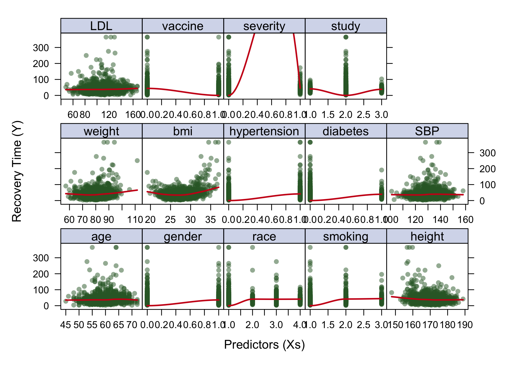
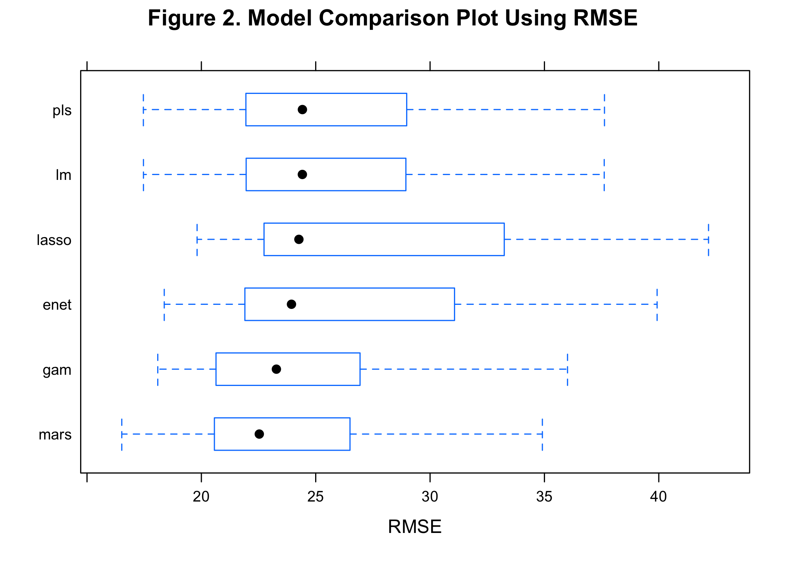

P8106 Data Science II Midterm Project Report: Predicting COVID-19
Recovery Time and Identifying Important Risk Factors
================
Sarah Forrest - sef2183
4/5/2023

# Background

To gain a better understanding of the factors that predict recovery time
from COVID-19 illness, a study was designed to combine three existing
cohort studies that have been tracking participants for several years.
The study collects recovery information through questionnaires and
medical records, and leverages existing data on personal characteristics
prior to the pandemic. The ultimate goal is to develop a prediction
model for recovery time and identify important risk factors for long
recovery time.

# Data

This project uses the “recovery.RData” file, which consists of 10000
participants. A random sample of 2000 participants is used for this
analysis using a seed set to my UNI number (2183).

``` r
set.seed(2183) # for reproducibility - my UNI

# read in dataset
load("data/recovery.Rdata")

# create a random sample of 2000 participants
dat <- dat[sample(1:10000, 2000),] 
```

Split the data into training (70%) and test (30%) sets

``` r
set.seed(2183)

# specify rows of training data (70% of the dataset)
trRows <- createDataPartition(dat$recovery_time, p = 0.7, list = FALSE)


# training data
dat_train <- dat[trRows, ]
## matrix of predictors
x <- model.matrix(recovery_time~.,dat)[trRows,-1]
## vector of response
y <- dat$recovery_time[trRows]


# test data
dat_test <- dat[-trRows, ]
## matrix of predictors
x2 <- model.matrix(recovery_time~.,dat)[-trRows,-1]
## vector of response
y2 <- dat$recovery_time[-trRows]
```

# Exploratory analysis and data visualization:

In this section, use appropriate visualization techniques to explore the
dataset and identify any patterns or relationships in the data.

``` r
# create dataset for exploratory analysis and data visualization

dat_train_viz <- dat_train %>%
  mutate(study = case_when( # turn study (character variable) into a numeric variable
    study == "A" ~ 1,
    study == "B" ~ 2,
    study == "C" ~ 3))

# Find the remaining non-numeric columns
non_numeric_cols <- sapply(dat_train_viz, function(x) !is.numeric(x))

# Convert non-numeric columns to numeric
dat_train_viz[, non_numeric_cols] <- lapply(dat_train_viz[, non_numeric_cols], as.numeric) # turn factor variables into numeric variables
```

The following code creates lattice plots to visualize the the
multivariate data. A plot is created for each of the 13 predictors in
the dataset in order to visualize each predictor’s association with the
outcome, `recovery_time` (COVID-19 recovery time).

``` r
# set various graphical parameters (color, line type, background, etc) to control the look of trellis displays
theme1 <- trellis.par.get()
theme1$plot.symbol$col <- rgb(.2, .4, .2, .5)
theme1$plot.symbol$pch <- 16
theme1$plot.line$col <- rgb(.8, .1, .1, 1)
theme1$plot.line$lwd <- 2
theme1$strip.background$col <- rgb(.0, .2, .6, .2)
trellis.par.set(theme1)

featurePlot(x = dat_train_viz[ ,2:15],
            y = dat_train_viz[ ,16],
            plot = "scatter",
            span = .5,
            labels = c("Predictors (Xs)", "Recovery Time (Y)"),
            type = c("p", "smooth"))
```

<!-- -->

\[Based on the lattice plots above, the following patterns in the data
can be observed: \]

# Model training:

In this section, describe the models you used for predicting time to
recovery from COVID-19. State the assumptions made by using the models.
Provide a detailed description of the model training procedure and how
you obtained the final model.

## Less flexible models:

Linear model:

``` r
set.seed(2183)

# 10-fold cross-validation repeated 5 times using the best rule
ctrl <- trainControl(method = "repeatedcv", number = 10, repeats = 5)

# Fit a linear regression model using cross-validation on the training dataset
linear_model <- train(recovery_time ~ age + gender + race + smoking + height + weight + 
                 bmi + hypertension + diabetes + SBP + LDL + vaccine + 
                 severity + study, 
               data = dat_train, 
               method = "lm", 
               trControl = ctrl)

# view the model summary and performance on the test set
summary(linear_model$finalModel)
## 
## Call:
## lm(formula = .outcome ~ ., data = dat)
## 
## Residuals:
##     Min      1Q  Median      3Q     Max 
## -64.119 -14.513  -1.103   9.605 252.860 
## 
## Coefficients:
##                Estimate Std. Error t value Pr(>|t|)    
## (Intercept)  -3.109e+03  2.031e+02 -15.306  < 2e-16 ***
## age          -1.049e-01  1.839e-01  -0.570 0.568643    
## gender       -7.061e+00  1.392e+00  -5.072 4.47e-07 ***
## race2         1.708e+00  2.928e+00   0.583 0.559903    
## race3        -1.384e+00  1.770e+00  -0.782 0.434469    
## race4        -1.644e+00  2.409e+00  -0.682 0.495145    
## smoking1      4.899e+00  1.560e+00   3.140 0.001722 ** 
## smoking2      8.278e+00  2.372e+00   3.491 0.000497 ***
## height        1.804e+01  1.195e+00  15.103  < 2e-16 ***
## weight       -1.927e+01  1.266e+00 -15.227  < 2e-16 ***
## bmi           5.844e+01  3.617e+00  16.159  < 2e-16 ***
## hypertension  3.662e+00  2.330e+00   1.572 0.116236    
## diabetes     -3.433e+00  1.977e+00  -1.737 0.082664 .  
## SBP           1.001e-01  1.524e-01   0.657 0.511393    
## LDL           2.597e-03  3.806e-02   0.068 0.945611    
## vaccine      -8.170e+00  1.414e+00  -5.778 9.33e-09 ***
## severity      6.256e+00  2.396e+00   2.611 0.009120 ** 
## studyB        4.355e+00  1.777e+00   2.450 0.014398 *  
## studyC       -1.339e+00  2.197e+00  -0.609 0.542396    
## ---
## Signif. codes:  0 '***' 0.001 '**' 0.01 '*' 0.05 '.' 0.1 ' ' 1
## 
## Residual standard error: 25.88 on 1383 degrees of freedom
## Multiple R-squared:  0.2909, Adjusted R-squared:  0.2817 
## F-statistic: 31.52 on 18 and 1383 DF,  p-value: < 2.2e-16

# view performance on the test set (RMSE)
test_pred <- predict(linear_model, newdata = dat_test)
test_rmse <- sqrt(mean((test_pred - dat_test$recovery_time)^2))
test_rmse
## [1] 27.34561

# calculate RMSE
sqrt(mean((test_pred - y2)^2)) 
## [1] 27.34561
```

/\* We then use the train function from the caret package to fit a
linear regression model to the training data using cross-validation with
10 folds. The trainControl function specifies the cross-validation
method, and the method argument specifies the type of model to fit (in
this case, linear regression). The resulting model object contains the
final model and information about the cross-validation performance.

We can view the summary statistics for the final model using the summary
function on the finalModel object within the model object. We can also
use the predict function to generate predictions for the test set using
the final model, and compute the root mean squared error (RMSE) between
the predicted and actual recovery times on the test set.

This approach allows us to obtain a final model that has been trained
using cross-validation, which can help to reduce overfitting and improve
the generalization performance of the model on new, unseen data. \*/

Lasso model:

``` r
set.seed(2183)

lasso_model <- train(x, y,
                   method = "glmnet",
                   tuneGrid = expand.grid(alpha = 1,
                                          lambda = exp(seq(-1, 5, length = 100))),
                   trControl = ctrl)

# view the model summary
summary(lasso_model$finalModel)
##             Length Class      Mode     
## a0            95   -none-     numeric  
## beta        1805   dgCMatrix  S4       
## df            95   -none-     numeric  
## dim            2   -none-     numeric  
## lambda        95   -none-     numeric  
## dev.ratio     95   -none-     numeric  
## nulldev        1   -none-     numeric  
## npasses        1   -none-     numeric  
## jerr           1   -none-     numeric  
## offset         1   -none-     logical  
## call           5   -none-     call     
## nobs           1   -none-     numeric  
## lambdaOpt      1   -none-     numeric  
## xNames        19   -none-     character
## problemType    1   -none-     character
## tuneValue      2   data.frame list     
## obsLevels      1   -none-     logical  
## param          0   -none-     list

# view performance on the test set (RMSE)
test_pred <- predict(lasso_model, newdata = x2)
test_rmse <- sqrt(mean((test_pred - dat_test$recovery_time)^2))
test_rmse
## [1] 29.25004

# calculate RMSE
sqrt(mean((test_pred - y2)^2)) 
## [1] 29.25004
```

Elastic net model:

``` r
set.seed(2183)

enet_model <- train(x, y,
                  method = "glmnet",
                  tuneGrid = expand.grid(alpha = seq(0, 1, length = 21), 
                                         lambda = exp(seq(2, -2, length = 50))),
                  trControl = ctrl)

# view the model summary
summary(enet_model$finalModel)
##             Length Class      Mode     
## a0            95   -none-     numeric  
## beta        1805   dgCMatrix  S4       
## df            95   -none-     numeric  
## dim            2   -none-     numeric  
## lambda        95   -none-     numeric  
## dev.ratio     95   -none-     numeric  
## nulldev        1   -none-     numeric  
## npasses        1   -none-     numeric  
## jerr           1   -none-     numeric  
## offset         1   -none-     logical  
## call           5   -none-     call     
## nobs           1   -none-     numeric  
## lambdaOpt      1   -none-     numeric  
## xNames        19   -none-     character
## problemType    1   -none-     character
## tuneValue      2   data.frame list     
## obsLevels      1   -none-     logical  
## param          0   -none-     list

# view performance on the test set (RMSE)
test_pred <- predict(enet_model, newdata = x2)
test_rmse <- sqrt(mean((test_pred - dat_test$recovery_time)^2))
test_rmse
## [1] 27.77037

# calculate RMSE
sqrt(mean((test_pred - y2)^2)) 
## [1] 27.77037
```

Partial least squares model:

``` r
set.seed(2183)

pls_model <- train(x, y,
                 method = "pls",
                 tuneGrid = data.frame(ncomp = 1:15), # CHECK THIS
                 trControl = ctrl,
                 preProcess = c("center", "scale"))

# view the model summary
summary(pls_model$finalModel)
## Data:    X dimension: 1402 19 
##  Y dimension: 1402 1
## Fit method: oscorespls
## Number of components considered: 13
## TRAINING: % variance explained
##           1 comps  2 comps  3 comps  4 comps  5 comps  6 comps  7 comps
## X           9.496    16.60    25.90    32.05    39.21    43.97    47.31
## .outcome   15.427    16.52    16.66    16.79    17.52    21.35    26.60
##           8 comps  9 comps  10 comps  11 comps  12 comps  13 comps
## X           52.18    56.01     58.67     62.48     64.45     69.21
## .outcome    27.61    28.24     28.84     28.96     29.09     29.10

# view performance on the test set (RMSE)
test_pred <- predict(pls_model, newdata = x2)
test_rmse <- sqrt(mean((test_pred - dat_test$recovery_time)^2))
test_rmse
## [1] 27.34691

# calculate RMSE
sqrt(mean((test_pred - y2)^2)) 
## [1] 27.34691
```

## More flexible models:

Generalized additive model (GAM):

``` r
set.seed(2183)

# fit GAM using all predictors
gam_model_all <- train(x, y, # test dataset
                 method = "gam",
                 trControl = ctrl, # 10-fold CV
                 control = gam.control(maxit = 200)) # Adjusted due to failure to converge at default setting

# fit GAM using selection specification
gam_model_select <- train(x, y, # test dataset
                 method = "gam",
                 tuneGrid = data.frame(method = "GCV.Cp", select = c(TRUE)),
                 trControl = ctrl, # 10-fold CV
                 control = gam.control(maxit = 200))  # Adjusted due to failure to converge at default setting


# view performance on the test set (RMSE) for the model with all predictors
test_pred <- predict(gam_model_all, newdata = x2)
test_rmse <- sqrt(mean((test_pred - dat_test$recovery_time)^2))
test_rmse
## [1] 25.44911

# calculate RMSE
sqrt(mean((test_pred - y2)^2)) 
## [1] 25.44911

# view performance on the test set (RMSE) for the model with select predictors
test_pred <- predict(gam_model_select, newdata = x2)
test_rmse <- sqrt(mean((test_pred - dat_test$recovery_time)^2))
test_rmse
## [1] 25.44911

# calculate RMSE
sqrt(mean((test_pred - y2)^2)) 
## [1] 25.44911
```

Multivariate adaptive regression spline (MARS) model:

``` r
set.seed(2183)

# create grid of all possible pairs that can take degree and nprune values
mars_grid <- expand.grid(degree = 1:3, # number of possible product hinge functions in 1 term
                         nprune = 2:15) # Upper bound of number of terms in model

mars_model <- train(x, y, # training dataset
                  method = "earth",
                  tuneGrid = mars_grid,
                  trControl = ctrl)

# calculate rmse
# view performance on the test set (RMSE)
test_pred <- predict(mars_model, newdata = x2)
test_rmse <- sqrt(mean((test_pred - dat_test$recovery_time)^2))
test_rmse
## [1] 23.93424

# calculate RMSE
sqrt(mean((test_pred - y2)^2)) 
## [1] 23.93424
```

Model comparison:

``` r
set.seed(2183)

resamp <- resamples(list(
  lm = linear_model,
  lasso = lasso_model,
  enet = enet_model,
  pls = pls_model,
  gam_all = gam_model_all,
  gam_select = gam_model_select,
  mars = mars_model
  ))

summary(resamp)
## 
## Call:
## summary.resamples(object = resamp)
## 
## Models: lm, lasso, enet, pls, gam_all, gam_select, mars 
## Number of resamples: 50 
## 
## MAE 
##                Min.  1st Qu.   Median     Mean  3rd Qu.     Max. NA's
## lm         13.06852 15.82773 16.65854 16.68009 17.52988 19.53885    0
## lasso      14.25976 15.90683 16.50266 16.88763 17.64133 20.09690    0
## enet       13.56718 15.46234 16.27012 16.30921 17.07305 19.28500    0
## pls        13.04234 15.81640 16.61516 16.68473 17.58882 19.52387    0
## gam_all    12.93263 15.20576 16.03940 15.90270 16.75525 19.46467    0
## gam_select 13.01962 15.13821 15.97227 15.98324 17.06011 18.41168    0
## mars       13.22956 14.94007 15.37132 15.68055 16.64782 19.36757    0
## 
## RMSE 
##                Min.  1st Qu.   Median     Mean  3rd Qu.     Max. NA's
## lm         17.46778 21.95953 24.41580 25.69236 28.94167 37.61437    0
## lasso      19.81918 22.76445 24.27349 27.48381 33.15122 42.22795    0
## enet       18.39835 21.91826 23.97856 26.12188 30.97916 39.97422    0
## pls        17.46113 21.94395 24.40605 25.73031 29.01531 37.69955    0
## gam_all    18.08181 20.84032 23.52972 24.03222 26.79926 36.04781    0
## gam_select 17.59415 20.97668 23.80596 24.17212 27.05597 36.03462    0
## mars       17.01555 20.97616 23.13004 23.76950 25.35356 36.86112    0
## 
## Rsquared 
##                  Min.   1st Qu.    Median      Mean   3rd Qu.      Max. NA's
## lm         0.04722889 0.1947930 0.2788224 0.2727476 0.3461258 0.4918482    0
## lasso      0.01729681 0.1291241 0.1714634 0.1640428 0.2141883 0.2931303    0
## enet       0.04074479 0.1988651 0.2579892 0.2444808 0.3170416 0.4390000    0
## pls        0.04554683 0.1932548 0.2742630 0.2708573 0.3448834 0.4907244    0
## gam_all    0.13396728 0.2703023 0.3532213 0.3686978 0.4406699 0.6293895    0
## gam_select 0.11312691 0.2699751 0.3741371 0.3677104 0.4503995 0.6116534    0
## mars       0.01480313 0.2957187 0.4024974 0.3862682 0.5067524 0.7512611    0

bwplot(resamp, metric = "RMSE")
```

<!-- -->

# Results:

In this section, report the final model that you built for predicting
time to recovery from COVID-19. Interpret the results. Assess the
model’s training/test performance.

# Conclusions:

In this section, summarize your findings from the model analysis and
discuss the insights gained into predicting time to recovery from
COVID-19.
